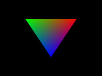
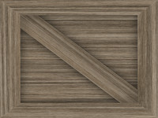
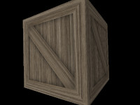
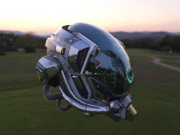

<p align="center"> 
  
</p>

In order to learn the concepts behind Vulkan, I am creating Illusion. For now, Illusion is a convenience layer on top of Vulkan, similar in spirit to [V-EZ](https://github.com/GPUOpen-LibrariesAndSDKs/V-EZ). However, I plan to add more features as I progress in learning. It uses C++17 and can be build on Linux (gcc or clang), Windows (msvc) and OS X (xcode).

### Build Status of Develop Branch


[](https://travis-ci.org/Simmesimme/illusion)

[](https://travis-ci.org/Simmesimme/illusion)

[](https://travis-ci.org/Simmesimme/illusion)

[](https://travis-ci.org/Simmesimme/illusion)

## Features

- [ ] Vulkan convenience layer
  - [x] Shader loading from Spir-V and GLSL using [glslang](https://github.com/KhronosGroup/glslang)
  - [x] Automatic reloading of shaders when source file changed on disc
  - [x] Automatic shader program reflection using [spirv-cross](https://github.com/KhronosGroup/SPIRV-Cross)
  - [x] Automatic creation of pipeline layouts
  - [x] Automatic allocation and updates of descriptor sets
  - [x] Automatic Vulkan object lifetime management using reference counting
  - [x] Automatic resource re-creation on swapchain changes
  - [x] Explicit graphics state per command buffer
  - [x] Explicit binding state per command buffer
  - [x] A ring-buffer for per-frame resources
  - [x] Per-frame resource count is independent from swapchain image count
  - [x] Conversion of equirectangular panoramas to cubemaps
  - [x] Creation of prefiltered irradiance and reflectance maps for physically based shading
  - [ ] HLSL Shader support
  - [ ] Shader includes
  - [ ] Automatic image layout transitions
  - [ ] Parallel command buffer recording
  - [ ] A frame or render-graph to automatically create renderpasses and subpasses with dependencies
  - [ ] ...
- [x] LDR and HDR texture loading ([stb](https://github.com/nothings/stb) and [gli](https://github.com/g-truc/gli) - dds, hdr, jpg, png, tga, bmp, ...)
- [ ] glTF loading ([tinygltf](https://github.com/syoyo/tinygltf))
  - [x] Metallic-roughness materials
  - [x] Specular-glossiness materials
  - [x] Animations
  - [x] Skins
  - [ ] Morph targets
  - [ ] Sparse accessors
  - [ ] Multiple texture coordinates
- [x] Mouse and joystick input ([glfw](https://github.com/glfw/glfw))

## Building Illusion

Illusion uses CMake for project file generation. Below are some exemplary instructions for Linux and Windows (here Visual Studio 2017) which you should adapt to your system.

### Dependencies

Nearly all dependencies are included as [git submodules](externals). Additionally you will need a C++ compiler, python3 and CMake. The following submodules are included in this repository and automatically build together with Illusion:

Submodule | Description
----------|------------
[glfw](https://github.com/glfw/glfw) | Used for window creation.
[gli](https://github.com/g-truc/gli) | Used for loading of dds textures.
[glm](https://github.com/g-truc/glm) | Used as math library.
[stb](https://github.com/nothings/stb) | Used for loading of LDR and HDR textures.
[glslang](https://github.com/KhronosGroup/glslang) | Used to compile GLSL to Spir-V
[spirv-cross](https://github.com/KhronosGroup/spirv-cross) | Used for shader program reflection.
[tinygltf](https://github.com/syoyo/tinygltf) | Used for loading of gLTF models.
[vulkan-headers](https://github.com/KhronosGroup/Vulkan-Headers) | This is usually part of the Vulkan SDK. In Illusion the Vulkan SDK is basically included in the submodules. This simplifies continuous integration.
[vulkan-loader](https://github.com/KhronosGroup/Vulkan-Loader) | Same as above.
[vulkan-validation-layers](../../KhronosGroup/Vulkan-ValidationLayers) | Same as above.
[spirv-tools](https://github.com/KhronosGroup/SPIRV-Tools) | Dependency of vulkan-validation-layers.
[spirv-headers](https://github.com/KhronosGroup/SPIRV-Headers) | Dependency of vulkan-validation-layers.

### Linux

```bash
git clone https://github.com/Simmesimme/illusion.git
cd illusion
git submodule update --init
mkdir build
cd build
cmake -DCMAKE_BUILD_TYPE=Release -DCMAKE_INSTALL_PREFIX=install ..
make -j install
```

### Windows

```bash
git clone https://github.com/Simmesimme/illusion.git
cd illusion
git submodule update --init
mkdir build
cd build
cmake -G "Visual Studio 15 2017 Win64" -DCMAKE_INSTALL_PREFIX=install ..
cmake --build . --target install
```

And then open the illusion.sln and build the ALL_BUILD and INSTALL targets.

## Included Examples

When compiled with the commands above, the examples will be located in `illusion/build/install/bin`. You can run them either by double-clicking or from the command line.

Link | Description | Screenshot
-----|-------------|-----------
[Triangle](examples/Triangle) | A simple triangle without vertex or index buffers that uses a pre-recorded command buffer and no per-frame resources. | 
[TexturedQuad](examples/TexturedQuad) | Similar to the triangle, in addition a texture is loaded and bound as fragment shader input. | 
[TexturedCube](examples/TexturedCube) | A more complex example using vertex buffers and an index buffer. Camera information is uploaded as uniform buffer, the cube's transformation is set via push constants. The command buffer is re-recorded every frame. The uniform buffer and the command buffer are per-frame resources. | 
[GltfViewer](examples/GltfViewer) | A viewer for glTF files. There are several command line options; have a look a `GltfViewer --help`. Most [glTFSample Models](https://github.com/KhronosGroup/glTF-Sample-Models/tree/master/2.0) are supported, including those with skinned animations. | 

## Documentation

For now, there is no documentation in addition to the example applications and the inline code comments. This will change once the API is more or less stable. Right now, entire classes may change completely in one commit.

### Credits

Here are some resources I am using while developing this software.

* [Vulkan Tutorial](https://vulkan-tutorial.com/): A great starting point for learning Vulkan.
* [Tutorials by Sascha Willems](https://github.com/SaschaWillems/Vulkan-glTF-PBR/): In particular the glTF example was very useful to understand some concepts.
* [V-EZ](https://github.com/GPUOpen-LibrariesAndSDKs/V-EZ): Especially the shader reflection of Illusion is based on code of V-EZ.
* [Granite](https://github.com/Themaister/Granite): I learned a lot from this great Vulkan engine. 
* [glTF sample models](https://github.com/KhronosGroup/glTF-Sample-Models/tree/master/2.0): These are very usefulf!
* [HDRI Haven](https://hdrihaven.com): Thank you Greg Zaal for your awesome work!
* [icons8.com](https://icons8.com): Some great icons!

### MIT License

Copyright (c) 2018 Simon Schneegans

Permission is hereby granted, free of charge, to any person obtaining a copy
of this software and associated documentation files (the "Software"), to deal
in the Software without restriction, including without limitation the rights
to use, copy, modify, merge, publish, distribute, sublicense, and/or sell
copies of the Software, and to permit persons to whom the Software is
furnished to do so, subject to the following conditions:

The above copyright notice and this permission notice shall be included in all
copies or substantial portions of the Software.

THE SOFTWARE IS PROVIDED "AS IS", WITHOUT WARRANTY OF ANY KIND, EXPRESS OR
IMPLIED, INCLUDING BUT NOT LIMITED TO THE WARRANTIES OF MERCHANTABILITY,
FITNESS FOR A PARTICULAR PURPOSE AND NONINFRINGEMENT. IN NO EVENT SHALL THE
AUTHORS OR COPYRIGHT HOLDERS BE LIABLE FOR ANY CLAIM, DAMAGES OR OTHER
LIABILITY, WHETHER IN AN ACTION OF CONTRACT, TORT OR OTHERWISE, ARISING FROM,
OUT OF OR IN CONNECTION WITH THE SOFTWARE OR THE USE OR OTHER DEALINGS IN THE
SOFTWARE.
